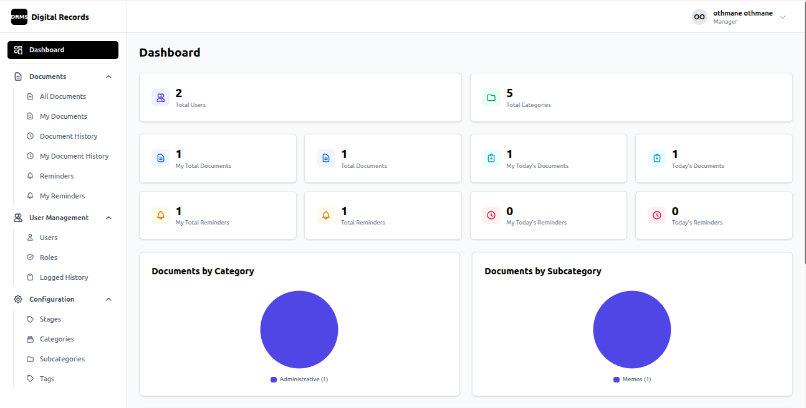
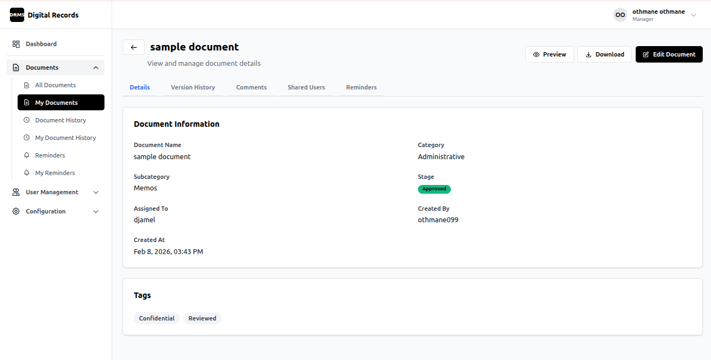

# DRMS - Digital Records Management System

A web-based system for managing and organizing digital records and documents.



## Features Implemented

### Core Document Management
- 📄 Create, update, archive documents with file uploads
- 📜 Version history with file versioning support
- 💬 Document comments
- 📊 Document activity history tracking

### User & Access Control
- 🔐 User authentication with session management
- 👥 Role-based access control (RBAC) with permissions
- 🔑 Custom user permissions
- 📝 Login history tracking

### Document Organization
- 🏷️ Categories and subcategories
- 🔖 Tags and Stages

### Collaboration
- 🤝 Document sharing with date ranges
- ⏰ Reminders with user assignments
- 📈 Dashboard



## Tech Stack

- **Backend:** Python 3.14+, FastAPI, SQLAlchemy, PostgreSQL
- **Frontend:** Next.js 16, React 19, TypeScript, TailwindCSS

## How to Run Locally

```bash
docker compose up
```

- **Backend:** http://localhost:8000
- **Frontend:** http://localhost:3000


## Project Status

🚧 **WIP** - Work in Progress
